# U.S-Superstore-sales-Analysis

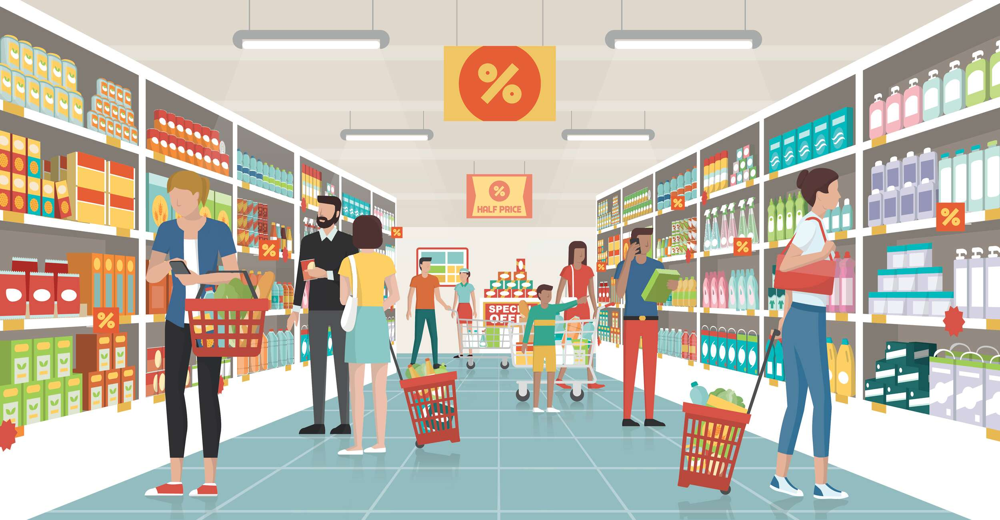

## INTRODUCTION
This is a an Excel project on the analysis on the sales of an imaginary store called **Us superstore** , this is aimed to help derive insights and help the company answer questions about their store using their data to enble them make more data driven decisions.

_Disclaimer: All datasets and report do not in any way represent any Company, This is just a dummy dataset to showcase my ability to use Excel_

### PROBLEM STATEMENT
1. **What are the Monthly or Quarterly Sales Trends?**
2. **Which Segment Are Top Sellers?**
3. **Which Categories Are Top Sellers?**
4. **What Is the Impact of Discounts on Profit?**
5. **Which Region Generates the Most Sales?**
6. **Effects of order processing time on sales**
7. **Who Are the Top Customers?**
8. **YEARLY GROWTH PROGRESS**

## Data preparation
In the initial preparation, i
- imported/loaded the data
- data inspection/ handling missing values 
- data cleaning / Removing duplicates
  
 _**PREPARING THE DATA FOR PIVOT CREATION**_
  
- After ensuring that the data was cleaned up nicely, i went ahead to make sure that daatypes matched and thats where i encountered my first problem
The more than half of the data in the dates in the data wasnt recogniced as a date function  by excel, i tried to make it recognize it, first i tried using the number column in the sales region and this proved abortive, i also tried using text to columns and that didnt work either, finally after an eternity of watching different youtube videos, i used the locale function in excel power query to make the date column to be regconized as date.
- When this was sorted out, i created a new column using the order and shipping date to get the total processing time for each order that was placed called Processing time
- i used the text() fuynction to extract the month and year of each transaction as different columns
- i used the formular =IF(X2=0,"NO Discount",IF(X2<0.2,"Low Discount","High Discount")) to create a new column called discount level from the DISCOUNT column and were we ready for our pivot creation.
  
- pivot table creation
- visualization

## ANALYSIS 
### KPIS
**Total Revenue**

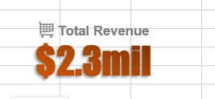

- The store generated a total revenue of $2,297,200.9mil through the period of four years.
-  With a total of 9994 sales

**Profit Margin**

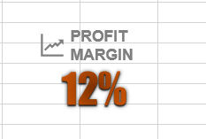

The store has a profit margin of 12% through period of four years which is low compared to the total revenue generated.

**Customer History**

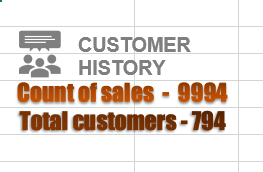

The store has a total of 
- **794** total current customers
- **9994** total sales
  
**Average order processing time**

The store has an average order processing time of 60 days through a period of four years.

### What are the Monthly or Quarterly Sales Trends?

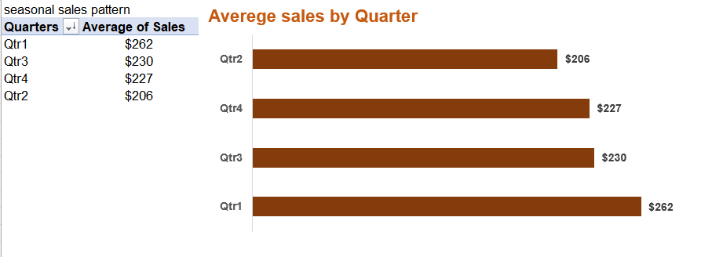

This showed that the sales where highest in 
- **Qtr 1** with the average sales of _$262_ .
- followed by Qtr 3 and Qtr 4 with the average sales of $230 and $227 respectively
-  while Qtr 2 is the lowest in sales for a period of four years. 

### Which Segment Are Top Sellers

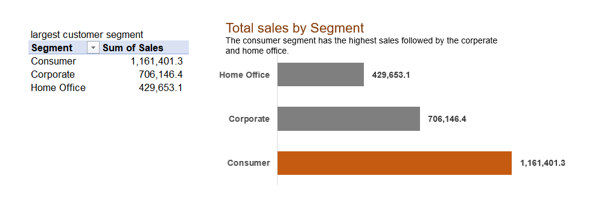

The store comprises of 3 segments :
- **CONSUMER**- this is the BEST performing segment with a total of $1,161,401.3 in four years
-  And **CORPORATE** being the second best with a total of $ 706,146.4 followed by **HOME OFFICE** with $429,653.1 sales in a period of four years.

 ### Which Categories Are Top Sellers?
 
 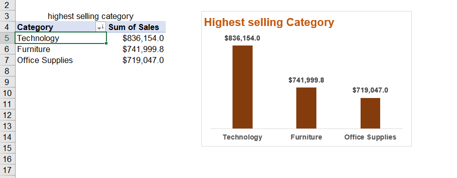
 
 The store segment are divided into 3 different categorys
 - **Technology**- The technology category is the best performing with a total of $836,154.0 in sales .
 - While **office supplies** is the lowest performing category with a total of $719,047.0 in sales  for a period of four years.

### Effects of order processing time on sales

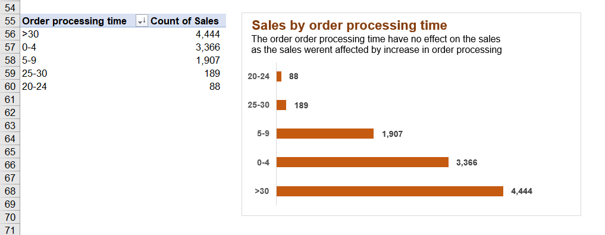

According to our data,
- The order processing time(days between order and shipping) doesnt seem to have any effect on the sales as sales kept being recored even when order processing time increased
- The highest sales were recorded within the order processing time _**>30 days**_, followed by _**0 - 4 days**_.
- The lowest sales was recorded within _**20 - 24days_**.

### What Is the Impact of Discounts on Profit?

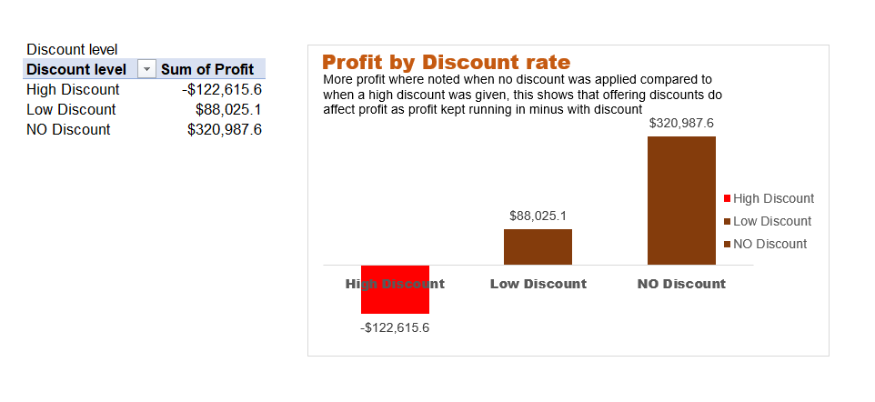

The profit by discount within a period of four years is divided into 3 categories
- 0 discount equals No discount and this has the highest sales count of 4778 with a profit of $320,987.
- >20% discount equals high discount which has the lowest sales count of 1139 with **NEGATIVE** PROFIT(LOSS) of -$122,615.6 with <20% being the low discount with a profit of $88,025.1
  
### Which Region Generates the Most Sales?

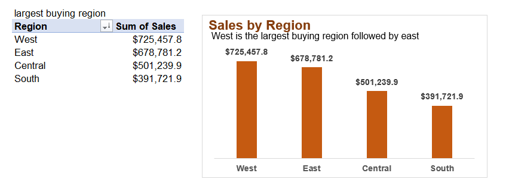

The store has sales in four regions with 
- The **WEST** being highest in sales of $725,457.8 followed by
- **EAST** total sales of $678,781.2 followed by **CENTRAL** with a sales total of $501,239.9 while the **SOUTH** falls behind with a sales total of $391,721.9.

### Who Are the Top Customers?

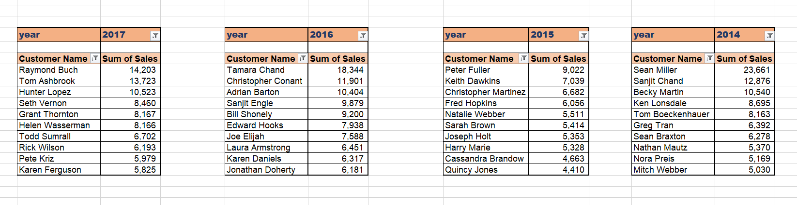

This is the highest buying customers across the years with the total revenue from each of them.

### Dashboard 

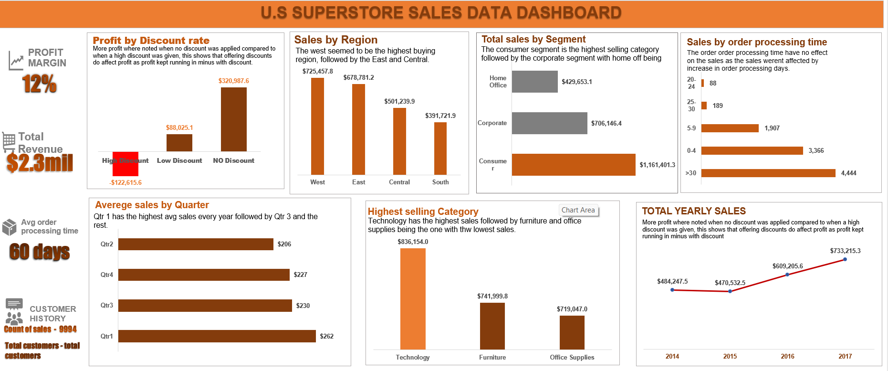

## CONCUDION AND RECOMMENDATION
### CONCLUSION
In my analysis of the sales dataset,
- i observed clear seasonal trends, with sales peaking in the first quarter of the year.
- Customer demographics played a significant role, as our younger customer segment exhibited higher purchase frequency
- Additionally, the 'High Discount' offer category displayed a strong positive correlation with decreased sales leading to Significant **LOSS**, Highlighting the importance of LOWER discounting OR NO DISCOUNT at all.
-  Overall, these insights will guide our sales strategy to maximize revenue and meet customer demands effectively."

## RECOMMENDATION
1. The Discount offer should be scrapped or reduced to the barest mininum as high discount is associated with low sales and **LOSS** in business funds.
2. Even tho negligible since it has no direct adverse effect on sales, More effective meathods should be utilized to hesten order processing time while maintaining quality of services  and customer relationship.
3. Enhance customer engagement strategies, including personalized offers, loyalty programs, and improved customer service, to further boost sales and cultivate customer loyalty.
4. Given the observed seasonal trends, consider allocating resources and marketing efforts to target the peak sales periods effectively. Special promotions and product launches can be planned to maximize revenue during these times.
5. More and efficient process should be adopted for better data collection.

   **THANK YOU**. 🙂

 

